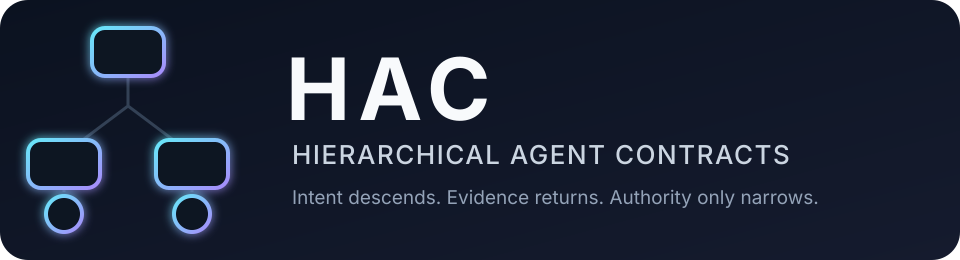
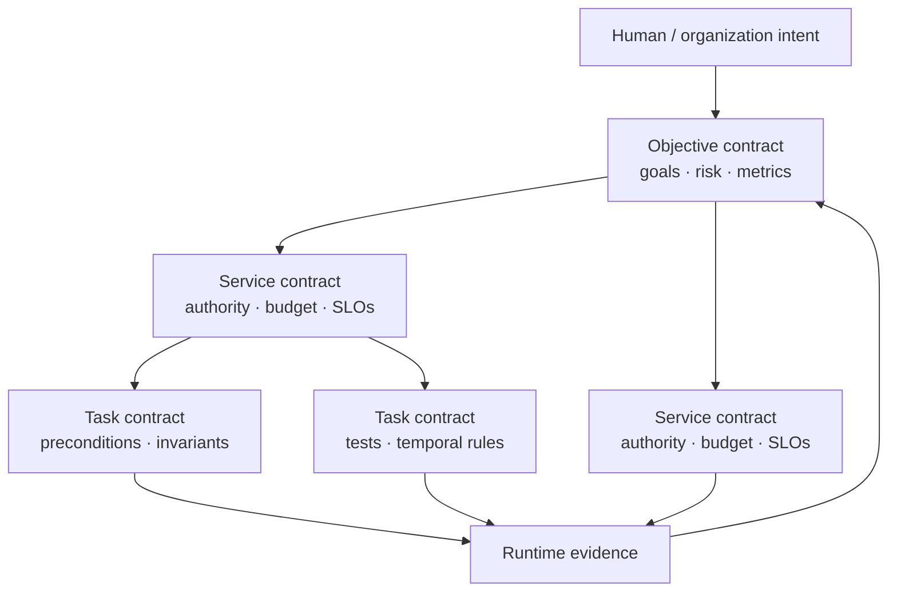
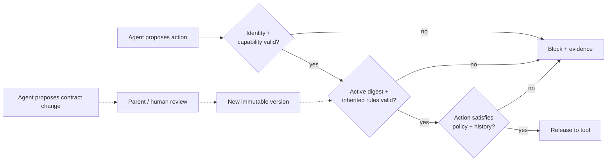

<p align="center">
  
</p>

<p align="center">
  <strong>A prototype control plane for turning human intent into inherited, testable constraints on multi-agent systems.</strong>
</p>

<p align="center">
  
  
  
  
</p>

Prompts express intent; they do not reliably bound authority. **HAC** (pronounced “hack”)
organizes goals, permissions, budgets, temporal requirements, and evidence into an immutable
contract hierarchy. Every delegation can add constraints, but cannot silently weaken its ancestors.



## The contract firewall

The operating agent cannot approve its own escape hatch. Contract updates travel through a
separate change path; actions travel through an independent enforcement path.

<p align="center">
  <a href="assets/hac-demo.mp4">
    
  </a>
  <br>
  <sub>Click the demo for the higher-quality MP4. Metrics shown are synthetic regression fixtures.</sub>
</p>



| Layer | What descends | What returns |
|---|---|---|
| Objective | outcomes, risk bounds, top-level metrics | assurance summary |
| Service | scoped authority, resource allocation, SLOs | contract status |
| Task | preconditions, limits, temporal obligations | traces and violations |

## Try it in 60 seconds

```bash
python3 -m venv .venv
source .venv/bin/activate
python3 -m pip install -e .

hac validate examples/support/contracts.json
hac trace examples/support/contracts.json \
  examples/support/unsafe_trace.json --contract support.refunds
hac compile "After risk detected, require escalate within 10 minutes."
hac benchmark
```

Unsafe example traces intentionally exit non-zero. None of the examples launches an agent or
calls a model.

## What is implemented

- **Composable contracts** — permissions, resources, budgets, assumptions, metrics, and hard/soft rules.
- **Verified delegation** — children must be issued by the parent subject and may only narrow authority.
- **Non-bypassable inheritance in the model** — ancestor rules are folded into every effective policy;
  attempts to redefine a rule fail validation.
- **Tamper evidence** — SHA-256 contract seals, parent-version pins, and a hash-linked activation ledger.
- **Attenuating capabilities** — signed demo credentials bind actor, action, resource, expiry, depth, and contract version.
- **Runtime firewall** — permissions, history-sensitive preconditions, bounds, counts, budgets, and MTL-style deadlines.
- **Accessible authoring** — a fail-closed controlled-English compiler for five common requirement patterns.
- **Single-service management** — `ContractManager` validates, activates, summarizes, and serves firewalls for a portfolio.

The current rule vocabulary maps to past-time LTL, MTL, first-order predicates, and arithmetic
constraints. The built-in engine performs deterministic finite-trace monitoring; SMT/model-checker
adapters are an extension point, not a feature claimed by this version.

## A tiny contract

```json
{
  "id": "support.refunds",
  "issuer": "agent:support-lead",
  "subject": "agent:refund-specialist",
  "parent_id": "support.root",
  "permissions": ["verify_identity", "issue_refund"],
  "limits": {"refund_usd": 400},
  "rules": [{
    "id": "refund.single-limit",
    "kind": "field_limit",
    "params": {"action": "issue_refund", "field": "refund_usd", "op": "<=", "value": 250}
  }]
}
```

The leaf also inherits `support.root`’s rule that identity verification must precede a refund.
See the complete [static support example](examples/support/contracts.json).

## Evaluation surface

`hac benchmark` runs seven labeled, deterministic action fixtures. It is a regression benchmark,
**not evidence about real-agent behavior**.

| Approach | Unsafe attempts prevented | False blocks | Requirements enforced | Delegation faults detected |
|---|---:|---:|---:|---:|
| Prompt only | 0 / 4 | 0 / 3 | 0 / 6 | 0 / 2 |
| Flat guardrail | 2 / 4 | 0 / 3 | 2 / 6 | 0 / 2 |
| HAC | **4 / 4** | **0 / 3** | **6 / 6** | **2 / 2** |

The harness also reports local decision latency. A real evaluation should add mutation score,
requirement-to-evidence coverage, composition defects, violation escape rate, false-block rate,
recovery time, monitor overhead, and human review load across representative agent traces.

## Why this helps alignment

HAC makes the chain from human intent to machine action explicit and inspectable. High-level
goals decompose into least-authority grants and testable obligations; evidence aggregates back up;
and runtime intervention can stop a known-bad action before a side effect. This supports scalable
oversight, corrigibility, auditability, and defense in depth. It does **not** solve value alignment:
a perfectly enforced bad or incomplete specification is still bad or incomplete.

## Research lineage

HAC adapts assume/guarantee contract-based design—not blockchain smart contracts—to agent
governance. The most direct inspiration is the formal model of **hierarchical contract nets** used
to synthesize assurance cases. Its foundations include:

- Wang et al., [*Hierarchical Contract-Based Synthesis for Assurance Cases*](https://doi.org/10.1007/978-3-031-06773-0_9) — hierarchical contract nets and refinement libraries.
- Benveniste et al., [*Contracts for System Design*](https://doi.org/10.1561/1000000053) — composition, refinement, and abstraction.
- Filippidis & Murray, [*Layering Assume-Guarantee Contracts for Hierarchical System Design*](https://authors.library.caltech.edu/records/r6eba-5m902) — hierarchical decomposition.
- Nuzzo et al., [*CHASE*](https://research.ibm.com/publications/chase-contract-based-requirement-engineering-for-cyber-physical-system-design) — accessible requirement patterns over a rigorous contract backend.
- Maler & Nickovic, [*Monitoring Temporal Properties of Continuous Signals*](https://doi.org/10.1007/978-3-540-30206-3_12) — Signal Temporal Logic and trace monitors.
- Oh et al., [*ARACHNE*](https://doi.org/10.1007/978-3-031-14835-4_5) — validation of assurance cases as hierarchical stochastic contract networks.
- Birgisson et al., [*Macaroons*](https://research.google/pubs/macaroons-cookies-with-contextual-caveats-for-decentralized-authorization-in-the-cloud/) — attenuating, caveated delegation.
- Ligatti, Bauer & Walker, [*Edit Automata*](https://cse.usf.edu/~ligatti/papers/TR-681-03.pdf) — runtime suppression and intervention.
- Ye & Tan, [*Agent Contracts*](https://arxiv.org/abs/2601.08815) — resource-bounded agent contracts and delegation conservation (2026 preprint).
- Kamath et al., [*Agent-C*](https://arxiv.org/abs/2512.23738) — temporal constraints and pre-action enforcement for LLM agents (2025 preprint).

The detailed concept-to-source map is in [docs/RESEARCH.md](docs/RESEARCH.md).

## Prototype boundaries

This repository is a research/portfolio prototype, not a production security boundary. The English
front end is intentionally narrow; HMAC keys are in-memory demo infrastructure; seals are tamper
evidence rather than proof of authorship; and the firewall only mediates tools routed through it.
There is no distributed consensus, KMS, revocation service, sandbox, arbitrary SMT solving, or
guarantee that requirements are complete, consistent, realizable, or aligned with stakeholder values.

Read the [technical specification](docs/SPEC.md) and [threat model](docs/THREAT_MODEL.md), then run:

```bash
PYTHONPATH=src python3 -m unittest discover -s tests -v
```

MIT licensed. Built to make agent governance concrete enough to inspect, test, and argue about.
