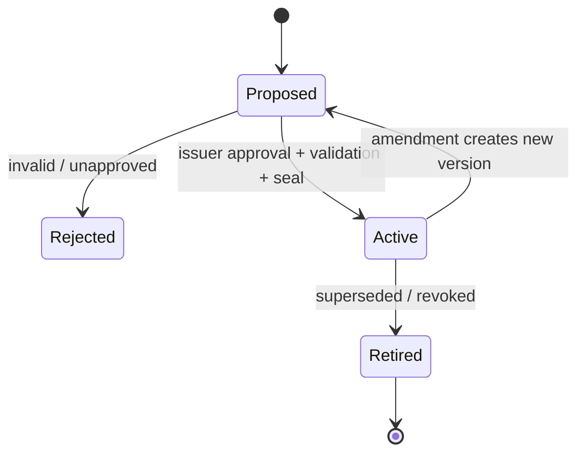

# HAC prototype specification

Status: **0.1 research prototype**. Normative words (`MUST`, `SHOULD`, `MAY`) describe this
repository's intended behavior, not a production standard.

## 1. Purpose

HAC is a contract control plane for multi-agent systems. It connects organization-level intent to
agent-level actions through a hierarchy of reviewable specifications. It aims to make delegation,
composition, enforcement, and assurance measurable without requiring every operator to learn a
formal specification language.

It is not a model-alignment proof, an agent framework, a blockchain protocol, or a general-purpose
theorem prover.

## 2. Contract model

A contract is represented as:

\[
C = (id, issuer, subject, intent, P, R, B, A, G, M, parent, version, seal)
\]

where:

| Field | Meaning |
|---|---|
| `issuer`, `subject` | principal granting authority and principal receiving it |
| `intent` | human-readable purpose; never used as the sole enforcement mechanism |
| `P`, `R` | permitted actions and resources |
| `B` | named resource allocations such as actions, tokens, cost, or refund value |
| `A` | explicit environment assumptions |
| `G` | deterministic hard or soft guarantee rules |
| `M` | metrics used to aggregate evidence toward the parent objective |
| `parent` | parent id plus the exact parent content digest |
| `version`, `seal` | immutable version metadata and SHA-256 content evidence |

An assume/guarantee reading is: when the declared assumptions hold, the subject is responsible for
the guarantees. The current monitor records assumptions but does not infer whether arbitrary
environment assumptions hold.

## 3. Refinement and delegation

For child contract `C` and parent `P`, HAC accepts `C ≼ P` only if:

1. `C.issuer = P.subject`;
2. `C.permissions ⊆ P.permissions` and `C.resources ⊆ P.resources` (with `*` as top);
3. every explicit child allocation is no larger than its parent allocation;
4. the sum of reserved sibling allocations is no larger than the parent allocation;
5. `C.parent_digest = digest(P)`;
6. every ancestor rule remains in the effective rule set; and
7. a child cannot reuse an ancestor rule id with different content.

Effective limits are the minimum limit present along the root-to-leaf path. Effective rules are the
ordered union of all ancestor and local rules. This makes omission non-weakening: a child cannot
escape a parent rule by leaving it out.

This prototype checks a useful structural refinement relation. It does not prove semantic
realizability, compatibility of arbitrary logics, or completeness of a decomposition.

## 4. Rule vocabulary and trace semantics

| Kind | Meaning at an event `e` | Explanatory formalization |
|---|---|---|
| `forbid` | matching action is blocked | `G ¬ action` |
| `requires_before` | a prerequisite must appear earlier, normally on the same resource | `G(action → O prerequisite)` |
| `response_within` | every trigger needs a later response before a bounded deadline | `G(trigger → F_[0,t] response)` |
| `field_limit` | a named event field must satisfy a comparison | first-order predicate / STL atom |
| `cumulative_limit` | sum of a named trace field cannot exceed a maximum | arithmetic/SMT invariant |
| `count_limit` | matching action count cannot exceed a maximum | arithmetic/SMT invariant |

`G`, `O`, and `F` mean globally, once in the past, and eventually in the future. Formulas rendered
by `hac compile` are explanatory. `src/hac/firewall.py` is the executable finite-trace semantics.

For a completed trace, an unsatisfied response obligation is a violation. For an open trace whose
deadline has not passed, it is pending. A hard violation blocks; a soft violation warns.

## 5. Accessible authoring

The controlled-English compiler accepts exactly five patterns:

```text
Never <action>.
Require <prerequisite> before <action>.
After <trigger>, require <response> within <N> seconds|minutes|hours.
Keep <field> <=|>=|<|> <number>.
Limit <action> to <N> times.
```

Text is normalized to snake-case action and field identifiers. Any other wording fails closed. A
human SHOULD review the generated rule and formula before activation. A future LLM authoring
assistant may propose translations, but it MUST NOT activate its own translation.

## 6. Identity and authorization

The demo capability chain binds:

```text
issuer → subject · actions · resources · expiry · remaining depth · contract digest
```

Each delegation MUST be signed by the current subject, MUST narrow action/resource authority,
MUST NOT extend expiry, and consumes one delegation level. Runtime authorization validates every
link and binds the leaf credential to the active contract version.

The implementation uses shared-secret HMAC solely to make the model executable without external
dependencies. Production use requires asymmetric workload identity, hardware/KMS-protected keys,
rotation, revocation, replay controls, audit retention, and policy for principal recovery.

## 7. Lifecycle and anti-rewrite boundary



Active dataclasses are immutable. Parent digests pin composition to exact versions. Activation
records form a hash chain. The firewall snapshots the root-to-leaf digest chain and rechecks it
before each decision.

The operating agent may propose a new contract, but the active instance never mutates in place.
The issuer—not the subject—approves the new version. An independent service must hold activation
authority and mediate every relevant tool path for this boundary to mean anything in deployment.

## 8. ContractManager service

`ContractManager` is the prototype organization-wide facade:

1. load the portfolio;
2. validate seals, hierarchy, attenuation, conservation, and rule inheritance;
3. activate roots before descendants into the ledger;
4. expose summaries for operators; and
5. return an independently configured firewall per contract.

`assess(candidate)` is deliberately non-mutating. A production manager would add durable storage,
multi-party approvals, revocation, version migration, event streaming, policy-as-code review, and
an assurance-case UI.

## 9. Firewall decision

For proposed event `e`, history `τ`, leaf contract `C`, and capability chain `K`:

```text
allow(e) iff
  snapshot_valid(C)
  ∧ actor(e) = subject(C)
  ∧ permitted(e, C)
  ∧ allocation_ok(τ · e, C)
  ∧ authorized(K, e, digest(C))
  ∧ every inherited hard rule accepts (τ, e)
```

The firewall returns `ALLOW`, `ALLOW_WITH_WARNING`, or `BLOCK` with rule-level evidence. It cannot
control side channels or tool paths that bypass mediation.

## 10. V&V strategy

Current:

- schema and lifecycle validation;
- compositional hierarchy checks;
- deterministic pre-action monitoring;
- completed/open finite-trace validation;
- mutation-oriented unit fixtures;
- synthetic comparison benchmark.

Planned extension points:

- SMT-LIB generation for compatibility, consistency, and budget constraints;
- LTL/MTL/STL monitor/model-checker adapters;
- probabilistic and quantitative robustness semantics;
- test generation from contracts and counterexample ingestion;
- assurance-case aggregation from leaf evidence to objective claims;
- semantic diff and human approval workflow for new versions.

## 11. Evaluation metrics

| Metric | Definition |
|---|---|
| violation escape rate | unsafe labeled attempts released / unsafe labeled attempts |
| false-block rate | safe labeled attempts blocked / safe labeled attempts |
| requirement coverage | requirements with an active monitor/test/proof artifact / requirements |
| delegation fault detection | invalid attenuation/conservation mutations rejected / injected mutations |
| composition defect rate | parent claims not supported by valid child contracts / parent claims |
| evidence latency | time from action/violation to visible parent-level evidence |
| decision overhead | firewall latency relative to unmediated execution |
| review load | human minutes and decisions per contract change |
| recovery time | time from violation to containment and safe resumption |

The checked-in benchmark only measures a small subset on deterministic fixtures and MUST NOT be
presented as an empirical comparison of live agents.

